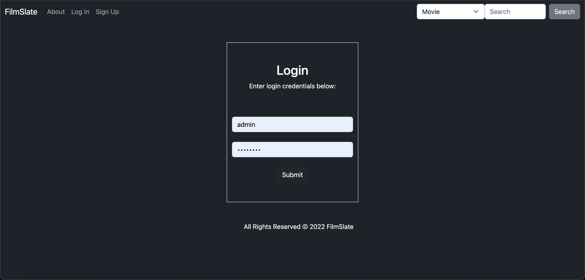
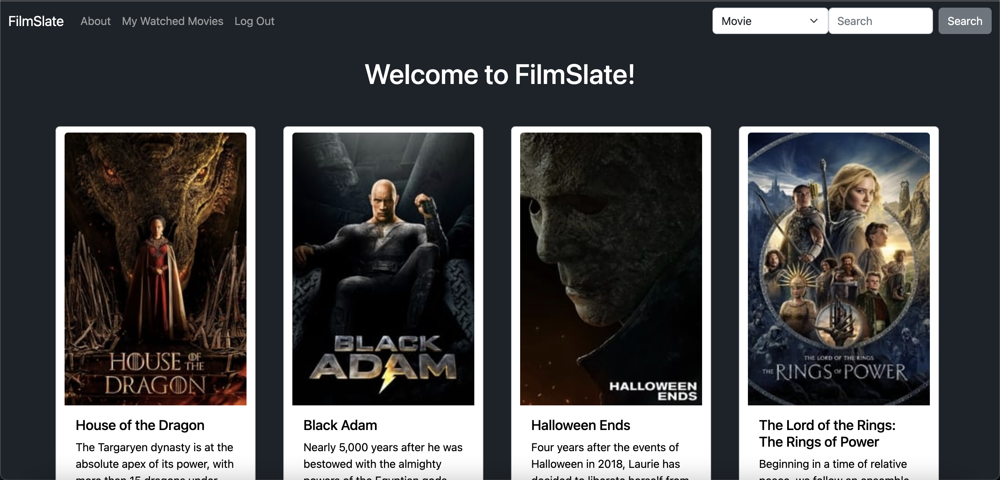
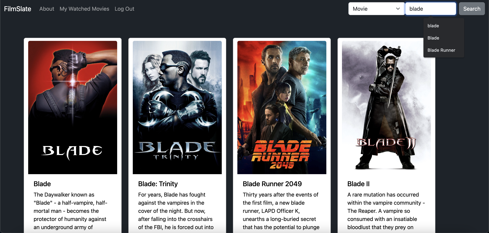
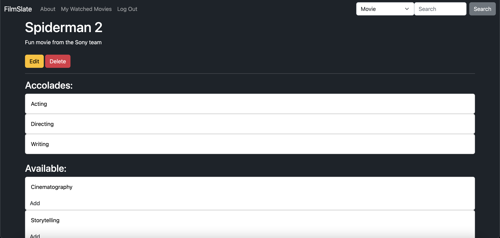
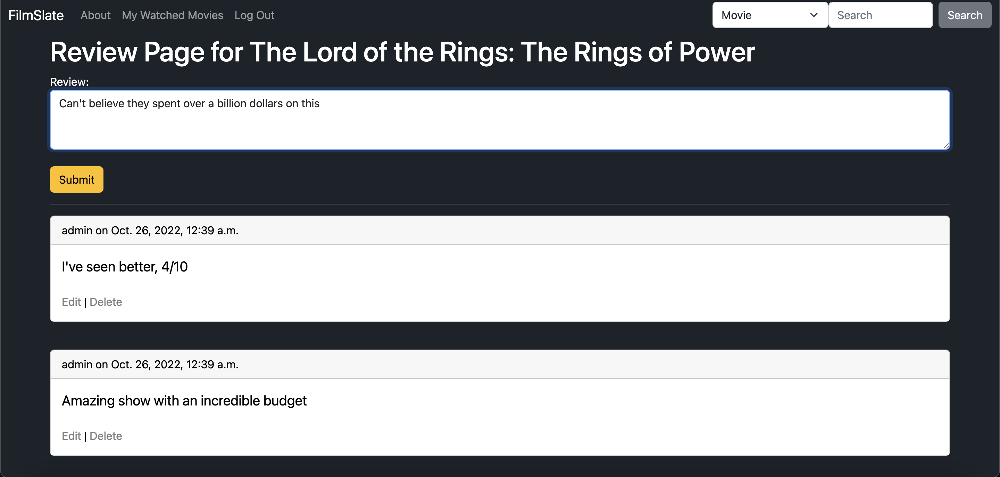
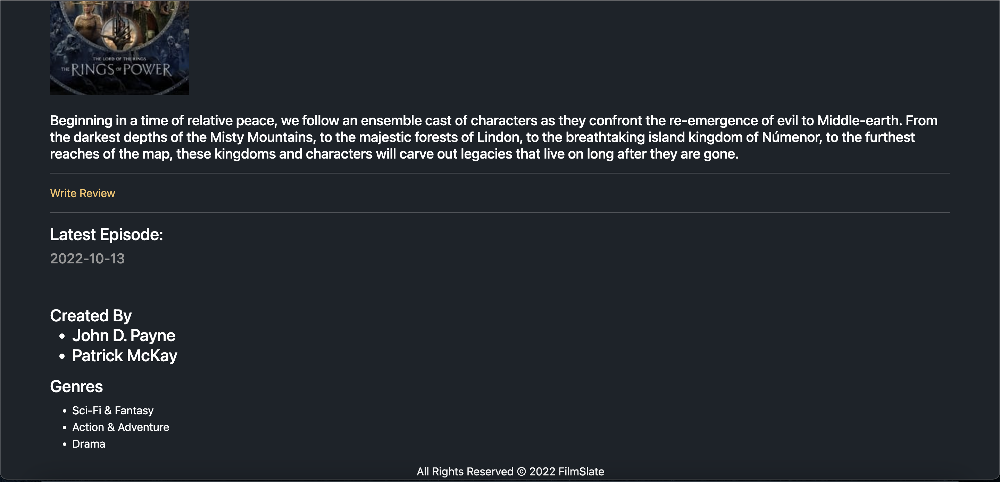

# FilmSlate

## An app that let's you search through thousands of movies and add reviews

# Technologies Used

* HTML5
* CSS3
* Javascript
* Python
* Django
* PostgreSQL
* Heroku
* Bootstrap
* TMDB API

## Screenshots

## Getting Started

https://filmslate.herokuapp.com/

## Future Enhancements

* Add feature that let's you reply to other user comments.
* Add feature that let's you search by category.
* Add feature that let's you add reactions to user comments.